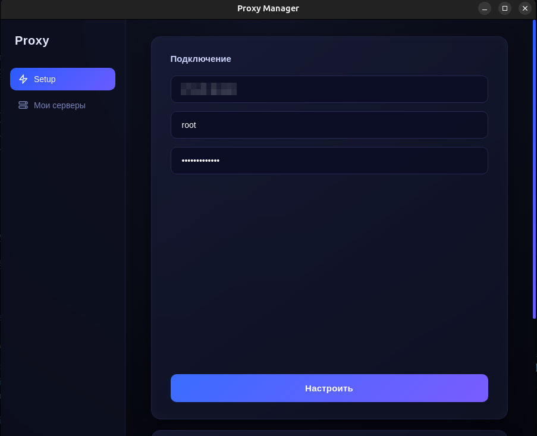
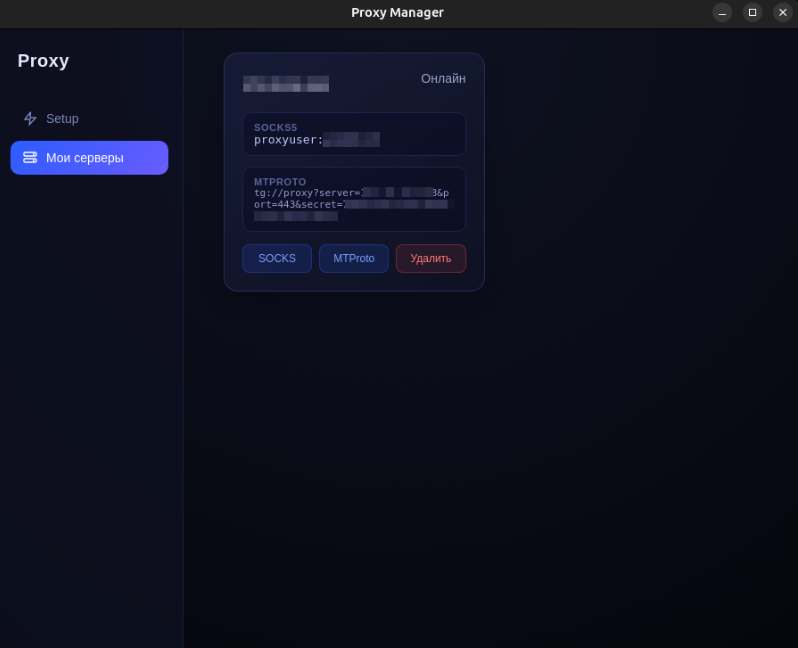

# Proxy Setup

Небольшое десктопное приложение, которое автоматически поднимает и настраивает прокси на вашем VPS.

---

## Что делает приложение

- Устанавливает и настраивает **SOCKS5 (Dante)** с логином и паролем
- Поднимает **MTProto прокси (Telegram)** через Docker
- Настраивает **Fail2Ban** (защита от брутфорса)
- Генерирует пользователя и пароль
- Сохраняет серверы прямо в приложении

---

## Скачать

Сборки лежат тут:
https://github.com/nnaxim/tg-auto-proxy/releases

| Платформа | Файл |
|----------|------|
| Windows  | `.exe` |
| Linux    | `.AppImage` |
| macOS    | `.dmg` |

---

## Скриншоты





---

## Как пользоваться

1. Покупаешь VPS (Ubuntu / Debian)
2. Открываешь приложение
3. Вводишь:
   - IP
   - SSH логин
   - пароль
4. Жмёшь **Настроить**
5. Ждёшь пару секунд

После этого у тебя:

- SOCKS5 прокси
- MTProto ссылка
- сервер сохранён в списке

---

## Требования

- Ubuntu 20.04+ / Debian
- Root доступ по SSH
- Открытый порт 1080

---

## Важно

- Если `proxyuser` уже существует - пароль **не меняется**
- Если MTProto уже запущен - контейнер не пересоздаётся

---

## Безопасность

- Fail2Ban автоматически включается
- Блокирует брутфорс SSH и SOCKS5
- Конфиг создаётся, если его нет

---

## Где тестировалось

Тестировалось на обычном VPS отсюда:
https://4vps.su

Это **не реклама**, просто там проверял работоспособность

---

## Где хранятся серверы

Серверы сохраняются временно в:

```
localStorage
```
---

## Сборка из исходников

```bash
git clone https://github.com/nnaxim/tg-auto-proxy.git
cd tg-auto-proxy
npm install
npm start
```

Сборка:

```bash
npm run build
```

---


## Планы

- Проверка статуса сервера
- Пинг
- Перезапуск сервера
- Несколько пользователей
- Нормальное хранилище вместо localStorage

---


## Зачем это вообще

Сделано в первую очередь как инструмент для себя:

- быстро поднять прокси
- не возиться с конфигами
- не вспоминать команды каждый раз
